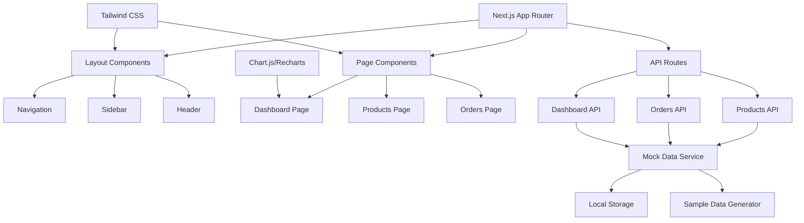

# Tasarım Belgesi

## Genel Bakış

E-ticaret yönetim paneli, Next.js 13+ App Router mimarisi ve Tailwind CSS kullanılarak geliştirilecek modern bir web uygulamasıdır. Uygulama, server-side rendering (SSR) ve client-side interactivity'nin optimal kombinasyonunu sağlayacak şekilde tasarlanmıştır.

Sistem üç ana modülden oluşur: Dashboard (özet veriler), Ürün Yönetimi ve Sipariş Takibi. Her modül bağımsız olarak çalışabilir ancak ortak veri katmanını paylaşır.

## Mimari

### Genel Mimari



### Klasör Yapısı

```
src/
├── app/
│   ├── layout.tsx                 # Root layout
│   ├── page.tsx                   # Dashboard page
│   ├── products/
│   │   ├── page.tsx              # Products list
│   │   ├── add/page.tsx          # Add product
│   │   └── [id]/edit/page.tsx    # Edit product
│   ├── orders/
│   │   ├── page.tsx              # Orders list
│   │   └── [id]/page.tsx         # Order details
│   └── api/
│       ├── products/route.ts
│       ├── orders/route.ts
│       └── dashboard/route.ts
├── components/
│   ├── ui/                       # Reusable UI components
│   ├── dashboard/                # Dashboard specific components
│   ├── products/                 # Product specific components
│   └── orders/                   # Order specific components
├── lib/
│   ├── storage.ts               # Local storage utilities
│   ├── mockData.ts              # Mock data generator
│   ├── dataService.ts           # Data service layer
│   ├── types.ts                 # TypeScript types
│   └── utils.ts                 # Utility functions
├── data/
│   ├── sampleProducts.ts        # Sample product data
│   ├── sampleOrders.ts          # Sample order data
│   └── sampleCustomers.ts       # Sample customer data
└── styles/
    └── globals.css              # Global styles with Tailwind
```

## Bileşenler ve Arayüzler

### Ana Layout Bileşeni

```typescript
// app/layout.tsx
interface RootLayoutProps {
  children: React.ReactNode;
}

// Sidebar navigation with active state management
// Responsive design with mobile hamburger menu
// Consistent header across all pages
```

### Dashboard Bileşenleri

```typescript
// components/dashboard/StatsCard.tsx
interface StatsCardProps {
  title: string;
  value: number;
  icon: React.ReactNode;
  trend?: {
    value: number;
    isPositive: boolean;
  };
}

// components/dashboard/SalesChart.tsx
interface SalesChartProps {
  data: SalesData[];
  timeRange: 'daily' | 'weekly' | 'monthly';
}

// components/dashboard/RecentOrders.tsx
interface RecentOrdersProps {
  orders: Order[];
  limit: number;
}
```

### Ürün Yönetimi Bileşenleri

```typescript
// components/products/ProductForm.tsx
interface ProductFormProps {
  product?: Product;
  onSubmit: (product: Product) => void;
  onCancel: () => void;
}

// components/products/ProductList.tsx
interface ProductListProps {
  products: Product[];
  onEdit: (id: string) => void;
  onDelete: (id: string) => void;
  searchTerm: string;
  categoryFilter: string;
}

// components/products/ProductCard.tsx
interface ProductCardProps {
  product: Product;
  onEdit: () => void;
  onDelete: () => void;
}
```

### Sipariş Takibi Bileşenleri

```typescript
// components/orders/OrderList.tsx
interface OrderListProps {
  orders: Order[];
  statusFilter: OrderStatus;
  onStatusChange: (orderId: string, status: OrderStatus) => void;
}

// components/orders/OrderDetails.tsx
interface OrderDetailsProps {
  order: Order;
  onStatusUpdate: (status: OrderStatus) => void;
}

// components/orders/StatusBadge.tsx
interface StatusBadgeProps {
  status: OrderStatus;
  size?: 'sm' | 'md' | 'lg';
}
```

### Ortak UI Bileşenleri

```typescript
// components/ui/Button.tsx
interface ButtonProps {
  variant: 'primary' | 'secondary' | 'danger';
  size: 'sm' | 'md' | 'lg';
  children: React.ReactNode;
  onClick?: () => void;
  disabled?: boolean;
}

// components/ui/Modal.tsx
interface ModalProps {
  isOpen: boolean;
  onClose: () => void;
  title: string;
  children: React.ReactNode;
}

// components/ui/LoadingSpinner.tsx
interface LoadingSpinnerProps {
  size?: 'sm' | 'md' | 'lg';
  color?: string;
}
```

## Veri Modelleri

### Mock Veri Servisi

```typescript
// lib/dataService.ts
interface DataService {
  // Products
  getProducts(): Promise<Product[]>;
  getProduct(id: string): Promise<Product | null>;
  createProduct(product: Omit<Product, 'id' | 'createdAt' | 'updatedAt'>): Promise<Product>;
  updateProduct(id: string, product: Partial<Product>): Promise<Product>;
  deleteProduct(id: string): Promise<boolean>;
  
  // Orders
  getOrders(): Promise<Order[]>;
  getOrder(id: string): Promise<Order | null>;
  updateOrderStatus(id: string, status: OrderStatus): Promise<Order>;
  
  // Dashboard
  getDashboardStats(): Promise<DashboardStats>;
  getSalesData(timeRange: 'daily' | 'weekly' | 'monthly'): Promise<SalesData[]>;
}

// Mock implementation with localStorage persistence
class MockDataService implements DataService {
  private initializeSampleData(): void;
  private generateSampleProducts(): Product[];
  private generateSampleOrders(): Order[];
  private generateSalesData(): SalesData[];
}
```

### Örnek Veri Yapıları

```typescript
// data/sampleProducts.ts
export const sampleProducts: Product[] = [
  {
    id: '1',
    name: 'iPhone 14 Pro',
    description: 'Apple iPhone 14 Pro 128GB Space Black',
    price: 34999,
    stock: 25,
    category: 'Elektronik',
    imageUrl: '/images/iphone14pro.jpg',
    createdAt: new Date('2024-01-15'),
    updatedAt: new Date('2024-01-15'),
    isActive: true
  },
  {
    id: '2',
    name: 'Samsung Galaxy S23',
    description: 'Samsung Galaxy S23 256GB Phantom Black',
    price: 28999,
    stock: 18,
    category: 'Elektronik',
    imageUrl: '/images/galaxys23.jpg',
    createdAt: new Date('2024-01-16'),
    updatedAt: new Date('2024-01-16'),
    isActive: true
  },
  // ... daha fazla örnek ürün
];

// data/sampleOrders.ts
export const sampleOrders: Order[] = [
  {
    id: '1',
    orderNumber: 'ORD-2024-001',
    customerName: 'Ahmet Yılmaz',
    customerEmail: 'ahmet@example.com',
    items: [
      {
        productId: '1',
        productName: 'iPhone 14 Pro',
        quantity: 1,
        price: 34999
      }
    ],
    totalAmount: 34999,
    status: 'processing',
    orderDate: new Date('2024-01-20'),
    shippingAddress: 'İstanbul, Türkiye',
    notes: 'Hızlı teslimat talep edildi'
  },
  // ... daha fazla örnek sipariş
];
```

### Ürün Modeli

```typescript
interface Product {
  id: string;
  name: string;
  description: string;
  price: number;
  stock: number;
  category: string;
  imageUrl?: string;
  createdAt: Date;
  updatedAt: Date;
  isActive: boolean;
}

interface ProductFormData {
  name: string;
  description: string;
  price: string; // Form'da string olarak alınır
  stock: string;  // Form'da string olarak alınır
  category: string;
  imageUrl?: string;
}
```

### Sipariş Modeli

```typescript
type OrderStatus = 'pending' | 'processing' | 'shipped' | 'delivered' | 'cancelled';

interface OrderItem {
  productId: string;
  productName: string;
  quantity: number;
  price: number;
}

interface Order {
  id: string;
  orderNumber: string;
  customerName: string;
  customerEmail: string;
  items: OrderItem[];
  totalAmount: number;
  status: OrderStatus;
  orderDate: Date;
  shippingAddress: string;
  notes?: string;
}
```

### Dashboard Veri Modeli

```typescript
interface DashboardStats {
  totalProducts: number;
  activeOrders: number;
  dailySales: number;
  totalRevenue: number;
  lowStockProducts: number;
  pendingOrders: number;
}

interface SalesData {
  date: string;
  sales: number;
  orders: number;
  revenue: number;
}

interface DashboardData {
  stats: DashboardStats;
  salesChart: SalesData[];
  recentOrders: Order[];
  topProducts: Product[];
}

// Mock veri üretici fonksiyonları
interface MockDataGenerator {
  generateDashboardStats(): DashboardStats;
  generateSalesData(days: number): SalesData[];
  generateRandomProducts(count: number): Product[];
  generateRandomOrders(count: number): Order[];
}
```

### Veri Kalıcılığı Stratejisi

```typescript
// lib/storage.ts
interface StorageService {
  // Generic storage operations
  setItem<T>(key: string, value: T): void;
  getItem<T>(key: string): T | null;
  removeItem(key: string): void;
  clear(): void;
  
  // Specific data operations
  saveProducts(products: Product[]): void;
  loadProducts(): Product[];
  saveOrders(orders: Order[]): void;
  loadOrders(): Order[];
  
  // Backup and restore
  exportData(): string;
  importData(data: string): boolean;
}

// Storage keys
const STORAGE_KEYS = {
  PRODUCTS: 'ecommerce_products',
  ORDERS: 'ecommerce_orders',
  SETTINGS: 'ecommerce_settings',
  LAST_BACKUP: 'ecommerce_last_backup'
} as const;
```

## Doğruluk Özellikleri

*Bir özellik (property), sistemin tüm geçerli çalıştırmalarında doğru olması gereken bir karakteristik veya davranıştır - esasen, sistemin ne yapması gerektiği hakkında resmi bir ifadedir. Özellikler, insan tarafından okunabilir spesifikasyonlar ile makine tarafından doğrulanabilir doğruluk garantileri arasında köprü görevi görür.*

### Özellik Yansıması

Prework analizini gözden geçirdikten sonra, aşağıdaki özellikler birleştirilebilir veya gereksizlik gösterir:

- **Ürün listeleme ve görüntüleme özellikleri** (2.5, 2.6): Bunlar tek bir kapsamlı ürün yönetimi özelliğinde birleştirilebilir
- **Sipariş listeleme ve görüntüleme özellikleri** (3.1, 3.2): Bunlar tek bir sipariş görüntüleme özelliğinde birleştirilebilir
- **Arama ve filtreleme özellikleri** (2.8, 3.3, 3.7): Benzer arama/filtreleme mantığını paylaşır, genel arama özelliği olarak birleştirilebilir
- **Veri kalıcılığı özellikleri** (5.1, 5.2, 5.3): localStorage round-trip özelliğinde birleştirilebilir

### Doğruluk Özellikleri

**Özellik 1: Ürün CRUD işlemleri veri bütünlüğü**
*Herhangi bir* geçerli ürün verisi için, ürün ekleme, güncelleme veya silme işlemi gerçekleştirildikten sonra, localStorage'dan okunan veri işlem sonucunu doğru şekilde yansıtmalıdır
**Doğrular: Gereksinimler 2.3, 2.7, 5.1, 5.2**

**Özellik 2: Geçersiz ürün verisi reddi**
*Herhangi bir* geçersiz ürün verisi (boş alan, negatif fiyat, geçersiz format) için, sistem hata mesajı döndürmeli ve veriyi kaydetmemelidir
**Doğrular: Gereksinimler 2.4**

**Özellik 3: Ürün arama ve filtreleme doğruluğu**
*Herhangi bir* ürün listesi ve arama/filtre kriteri için, döndürülen sonuçlar yalnızca kriterleri karşılayan ürünleri içermelidir
**Doğrular: Gereksinimler 2.8**

**Özellik 4: Sipariş durum güncelleme tutarlılığı**
*Herhangi bir* sipariş ve geçerli durum değeri için, durum güncelleme işlemi gerçekleştirildikten sonra, sipariş listesinde görünen durum güncellenmiş değeri yansıtmalıdır
**Doğrular: Gereksinimler 3.3, 5.2**

**Özellik 5: Sipariş listeleme ve görüntüleme bütünlüğü**
*Herhangi bir* sipariş listesi için, her sipariş öğesi sipariş numarası, müşteri adı, sipariş tarihi, durum ve toplam tutar bilgilerini içermelidir
**Doğrular: Gereksinimler 3.1, 3.2**

**Özellik 6: Sipariş arama fonksiyonalitesi**
*Herhangi bir* sipariş listesi ve arama terimi için, arama sonuçları yalnızca arama terimiyle eşleşen siparişleri içermelidir
**Doğrular: Gereksinimler 3.7**

**Özellik 7: Sipariş tarih sıralama doğruluğu**
*Herhangi bir* sipariş listesi için, tarih sıralaması uygulandığında, sonuçlar kronolojik sırada olmalıdır
**Doğrular: Gereksinimler 3.5**

**Özellik 8: Dashboard veri görüntüleme bütünlüğü**
*Herhangi bir* dashboard veri seti için, render edilen dashboard toplam ürün sayısı, aktif sipariş sayısı ve günlük satış verilerini içermelidir
**Doğrular: Gereksinimler 1.2**

**Özellik 9: Grafik veri görselleştirme**
*Herhangi bir* satış verisi için, grafik bileşeni veriyi görsel formatta temsil etmelidir
**Doğrular: Gereksinimler 1.3**

**Özellik 10: Form geri bildirim mekanizması**
*Herhangi bir* form işlemi için, işlem tamamlandığında sistem başarı veya hata mesajı göstermelidir
**Doğrular: Gereksinimler 4.4**

**Özellik 11: Aktif sayfa göstergesi**
*Herhangi bir* sayfa navigasyonu için, navigasyon menüsü aktif sayfayı görsel olarak belirtmelidir
**Doğrular: Gereksinimler 4.2**

**Özellik 12: Yükleme durumu göstergesi**
*Herhangi bir* asenkron işlem sırasında, sistem yükleme göstergesi görüntülemelidir
**Doğrular: Gereksinimler 4.6**

**Özellik 13: LocalStorage veri kalıcılığı round-trip**
*Herhangi bir* sistem verisi için, localStorage'a kaydetme ve ardından okuma işlemi orijinal veriyle eşdeğer sonuç üretmelidir
**Doğrular: Gereksinimler 5.1, 5.3**

**Özellik 14: Sayfalama fonksiyonalitesi**
*Herhangi bir* büyük veri listesi için, sayfalama uygulandığında her sayfa belirtilen öğe sayısını aşmamalıdır
**Doğrular: Gereksinimler 5.4**

**Özellik 15: Veri yedekleme round-trip**
*Herhangi bir* sistem verisi için, yedekleme ve ardından geri yükleme işlemi orijinal veriyle eşdeğer sonuç üretmelidir
**Doğrular: Gereksinimler 5.5**

## Hata Yönetimi

### Hata Türleri ve Yönetimi

**Veri Doğrulama Hataları:**
- Form validasyon hataları kullanıcıya anında gösterilir
- Hata mesajları Türkçe ve anlaşılır olacak
- Hatalı alanlar görsel olarak vurgulanacak

**LocalStorage Hataları:**
- Storage quota aşımı durumunda kullanıcı uyarılır
- Veri bozulması durumunda varsayılan değerler yüklenir
- Fallback mekanizması ile uygulama çalışmaya devam eder

**UI Hataları:**
- Component render hataları Error Boundary ile yakalanır
- Kullanıcıya anlamlı hata mesajları gösterilir
- Sayfa yenileme seçeneği sunulur

**API Hataları:**
- Network hataları için retry mekanizması
- Timeout durumları için kullanıcı bilgilendirmesi
- Graceful degradation ile temel fonksiyonalite korunur

## Test Stratejisi

### İkili Test Yaklaşımı

**Birim Testleri:**
- Belirli örnekler ve edge case'ler için
- Component render testleri
- Utility fonksiyon testleri
- Form validasyon testleri
- Error handling testleri

**Özellik Tabanlı Testler:**
- Evrensel özellikler için kapsamlı test coverage
- Her test minimum 100 iterasyon çalıştırılacak
- Jest ve @testing-library/react kullanılacak
- Property-based testing için fast-check kütüphanesi kullanılacak

**Test Konfigürasyonu:**
- Her özellik testi tasarım belgesindeki özelliğe referans verecek
- Tag formatı: **Feature: ecommerce-admin-dashboard, Property {numara}: {özellik_metni}**
- Her doğruluk özelliği TEK bir property-based test ile implement edilecek

**Test Kapsamı:**
- Birim testler: Spesifik örnekler, edge case'ler, hata durumları
- Özellik testleri: Evrensel özellikler, kapsamlı input coverage
- Birlikte: Kapsamlı coverage (birim testler somut bugları yakalar, özellik testleri genel doğruluğu doğrular)

### Test Araçları

- **Jest**: Test runner ve assertion library
- **@testing-library/react**: Component testing
- **@testing-library/user-event**: User interaction simulation
- **fast-check**: Property-based testing library
- **MSW (Mock Service Worker)**: API mocking